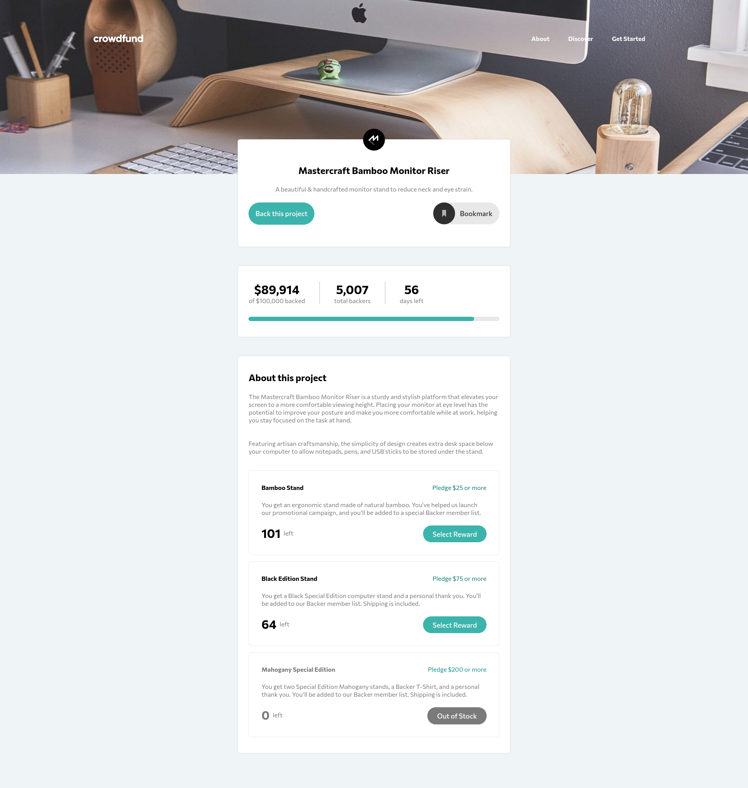

# Frontend Mentor - Crowdfunding product page solution

This is a solution to the [Crowdfunding product page challenge on Frontend Mentor](https://www.frontendmentor.io/challenges/crowdfunding-product-page-7uvcZe7ZR). Frontend Mentor challenges help you improve your coding skills by building realistic projects. 

## Table of contents

- [Overview](#overview)
  - [The challenge](#the-challenge)
  - [Screenshot](#screenshot)
  - [Links](#links)
- [My process](#my-process)
  - [Built with](#built-with)
  - [What I learned](#what-i-learned)
  - [Continued development](#continued-development)
  - [Useful resources](#useful-resources)
- [Author](#author)


## Overview

### The challenge

Users should be able to:

- View the optimal layout depending on their device's screen size
- See hover states for interactive elements
- Make a selection of which pledge to make
- See an updated progress bar and total money raised based on their pledge total after confirming a pledge
- See the number of total backers increment by one after confirming a pledge
- Toggle whether or not the product is bookmarked

### Screenshot



### Links

- Solution URL: [my github](https://github.com/RadasinR/crowdfunding-product-page.git)
- Live Site URL: [live site](https://crowdfunding-product-page-teal-two.vercel.app/)

## My process

### Built with

- Semantic HTML5 markup
- CSS custom properties
- Flexbox
- Mobile-first workflow


### What I learned

I learn how to make modals, how to work on larger projects.
```html
  <dialog id="completed" class="completed">
        
        <div>
          <h2 class="title">Thanks for your support! </h2>
          <p class="text-box accent--grey">
            Your pledge brings us one step closer to
            sharing Mastercraft Bamboo Monitor Riser worldwide. You will get an
            email once our campaign is completed.
          </p>
        </div>
        <button class="btn btn--cyan btn--medium" onclick="notified()">Got it!</button>
      </dialog>
```
```css
.sr-only {
  clip: rect(1px, 1px, 1px, 1px);
  clip-path: inset(50%);
  height: 1px;
  width: 1px;
  margin: -1px;
  overflow: hidden;
  padding: 0;
  position: absolute;
}
```
```js
function openModal() {
  let modal = document.getElementById("modal");
  modal.showModal();
}
```

### Continued development
I will continue to learn.

### Useful resources

- [Dialog](https://www.youtube.com/watch?v=TAB_v6yBXIE) - How to make and style a dialog.


## Author


- Frontend Mentor - [@Radasin](https://www.frontendmentor.io/profile/Radasin)

